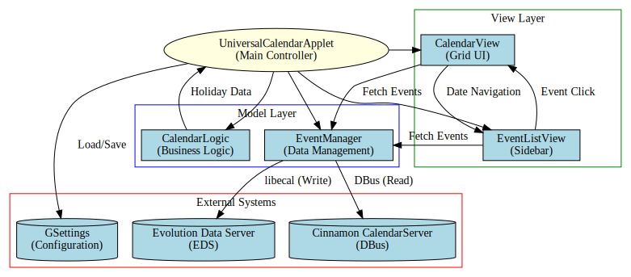

# Projekt IT Calendar

**Cinnamon Spices Applet** – A comprehensive calendar for Cinnamon with holidays, system events, and modern TypeScript architecture.  
Written in **TypeScript**, with modular compilation for development and production.

---

## 🌟 Features

- **📅 Complete Calendar Views:**
  - Month view with week numbers
  - Year overview with quick month selection  
  - Day detail view with events and holidays

- **🎉 Advanced Holiday System:**
  - Regional holiday configurations (DE, AT, CH, and more)
  - Automatic locale detection
  - Support for fixed-date and Easter-based holidays
  - Historical holiday rules with year-based conditions

- **📅 Event Integration:**
  - Synchronization with Cinnamon Calendar Server (Evolution/Google Calendar)
  - Event indicators in month view
  - Detailed event lists in day view
  - Color-coded event display

- **⌨️ Enhanced Navigation:**
  - Mouse scroll for month navigation
  - Keyboard arrow keys for navigation
  - "Today" button to reset view
  - Responsive UI with tooltips

- **🌍 Internationalization:**
  - Multi-language support via gettext
  - Localized day/month names
  - System locale detection

- **⚡ Modern Architecture:**
  - TypeScript with strict type checking
  - Modular design with separation of concerns
  - Hybrid module system for Cinnamon compatibility
  - Production and development build modes

---

## 🏗️ Project Structure

```
calendar/
├── src/                           # TypeScript source files
│   ├── applet.ts                 # Main applet controller
│   ├── CalendarLogic.ts          # Holiday calculations and date logic
│   ├── CalendarView.ts           # Main calendar UI components
│   ├── EventManager.ts           # System calendar integration
│   ├── EventListView.ts          # Event list rendering
│   └── declarations.d.ts         # TypeScript declarations
├── files/                        # Build output directory
│   └── calendar@projektit.de/    # Production applet files
├── holidays/                     # Holiday definitions by language
│   ├── de.json                  # German holidays (national/regional)
│   ├── en.json                  # English holidays
│   └── ...
├── locale/                       # Translation files
│   └── de/LC_MESSAGES/
│       └── calendar.po
├── metadata.json                 # Applet metadata
├── stylesheet.css                # Custom styling
├── build.sh                      # Build script (dev/prod modes)
├── tsconfig.json                 # TypeScript configuration
├── tsconfig.dev.json             # Development build config
├── tsconfig.prod.json            # Production build config
└── README.md                     # This file
```

---

## ⚙️ Installation

### For Users:
1. **From Cinnamon Spices:**  
   Download from [Cinnamon Spices](https://cinnamon-spices.linuxmint.com/applets/view/xxx)

2. **Manual Installation:**
   ```bash
   git clone https://github.com/ArnoldSchiller/calendar.git
   cd calendar
   ./build.sh prod
   ```
   The applet will be installed to `~/.local/share/cinnamon/applets/calendar@projektit.de`

3. **Enable in Cinnamon:**
   - Right-click panel → Add Applets
   - Find "Calendar" in the list
   - Add to panel

## 🌍 Internationalization & Translations

This applet features smart translation handling without requiring separate translation files:

### Smart Translation Strategy:
The applet uses a **three-tier fallback system** for translations:

1. **Applet Context** - First checks for applet-specific translations
2. **Cinnamon Core** - Falls back to Cinnamon's translations
3. **GNOME Calendar** - Uses GNOME Calendar translations as final fallback

### How it works:
```typescript
function _(str: string) {
    // Priority: 1. Applet, 2. Cinnamon, 3. GNOME Calendar
    let custom = Gettext.dgettext(uuid, str);
    if (custom !== str) return custom;
    let cinnamon = Gettext.dgettext("cinnamon", str);
    if (cinnamon !== str) return cinnamon;
    return Gettext.dgettext("gnome-calendar", str);
}
```

### Benefits:
- **Immediate multi-language support** without creating translation files
- **Leverages existing translations** from well-maintained projects
- **Reduced maintenance** - no need to manage `.po` files
- **Consistent terminology** with the rest of the desktop environment

### Currently Supported Languages:
The applet automatically supports all languages that Cinnamon and GNOME Calendar support, including but not limited to:
- English (en)
- German (de)
- French (fr) 
- Spanish (es)
- Italian (it)
- And many more...

### Adding Applet-Specific Translations:
While not required, if you want to add applet-specific translations:

1. Create a `.po` file for your language:
```
locale/
└── [lang]/LC_MESSAGES/
    └── calendar.po
```

2. Add translations using standard gettext format:
```po
msgid "Import a Calendar (.ics)"
msgstr "Kalender importieren (.ics)"
```

3. The applet will prioritize your custom translations over the fallbacks.

### Notes for Translators:
- The applet uses common calendar terminology already translated in Cinnamon/GNOME
- Only truly unique strings might need applet-specific translations
- Consider contributing translations upstream to Cinnamon/GNOME for broader impact

---


## 🔬 Technical Comparison

| Feature | This Applet | Traditional Cinnamon Calendar |
|---------|-------------|-------------------------------|
| **Codebase** | TypeScript with types | Plain JavaScript (2012) |
| **Architecture** | Modular, separated concerns | Monolithic `eventViewer.js` |
| **Build System** | Dev/Prod with AMD bundling | Manual concatenation |
| **Holiday System** | JSON-based, regional, historical | Hardcoded, limited |
| **Event Integration** | DBus via Calendar Server | Mixed approaches |
| **Translation** | Smart fallback system | Manual .po files |
| **Maintenance** | Easy to extend | Difficult to modify |


### For Developers:
*Please read the addendum at the end of this README!*

```bash
# Clone repository
git clone https://github.com/ArnoldSchiller/calendar.git
cd calendar

# Development build (modular files)
./build.sh dev

# Production build (single applet.js)
./build.sh prod

# Test in Cinnamon
# Copy to applets directory or use symlink
ln -s "$PWD/files/calendar@projektit.de" ~/.local/share/cinnamon/applets/
```

---

## 🔧 Building

### Development Mode (Modular):

*Please read the addendum at the end of this README!*

```bash
./build.sh dev
```
- Outputs separate `.js` files
- Uses Cinnamon's `requireModule` for dynamic loading
- Easier debugging with individual source files
- Installs as `calendar-dev@projektit.de`

### Production Mode (Bundled):

*Please read the addendum at the end of this README!*

```bash
./build.sh prod
```
- Creates single `applet.js` bundle
- Includes AMD loader for Cinnamon compatibility
- Optimized for distribution
- Installs as `calendar@projektit.de`

### TypeScript Configuration:
- **Development:** `tsconfig.dev.json` → `module: "None"`
- **Production:** `tsconfig.prod.json` → `module: "AMD"`

---

## 🧩 Architecture

### Core Components:
1. **`applet.ts`** - Main controller, connects Cinnamon panel with components
2. **`CalendarLogic.ts`** - Pure date logic, holiday calculations, JSON loading
3. **`CalendarView.ts`** - UI rendering (grid, navigation, views)
4. **`EventManager.ts`** - DBus communication with Cinnamon Calendar Server
5. **`EventListView.ts`** - Event list display component

### Key Design Decisions:
- **Hybrid Module System:** Uses both `exports` (AMD) and `global` assignment for Cinnamon compatibility
- **State-Driven UI:** Central `.render()` method updates all views on state change
- **Separation of Concerns:** Logic, UI, and data management in separate modules
- **GJS Compatibility:** Uses native GLib/Gio instead of Node.js APIs



*Generated from [architecture.dot](docs/architecture.dot)*
---

## 📊 Holiday System

```
files/calendar@projektit.de/holidays:
ar.json  ca.json       el.json  fi.json  hu.json  kk.json  mt.json  pt.json  sl.json                 sv.json           vi.json
be.json  cs.json       en.json  fr.json  id.json  ko.json  nb.json  ro.json  sr@ijekavian.json       tr.json           wa.json
bg.json  da.json       es.json  ga.json  is.json  lb.json  nl.json  ru.json  sr@ijekavianlatin.json  uk.json           zh.json
bn.json  default.json  et.json  he.json  it.json  lt.json  nn.json  si.json  sr.json                 uz@cyrillic.json
bs.json  de.json       fa.json  hr.json  ja.json  lv.json  pl.json  sk.json  sr@latin.json           uz.json
```
Data based on the KDE KHolidays framework (plan2 files generated 2025)

### Configuration Files:
Holidays are defined in JSON files in `/holidays/`:
```json
{
  "regions": {
    "de": [
      {"n": "New Year", "k": "f", "m": 1, "d": 1},
      {"n": "Christmas", "k": "f", "m": 12, "d": 25}
    ],
    "de-BY": [
      {"n": "Assumption Day", "k": "f", "m": 8, "d": 15}
    ]
  }
}
```

### Holiday Types:
- **Fixed Date (`"k": "f"`)**: Specific month/day
- **Easter-based (`"k": "e"`)**: Offset from Easter Sunday
- **Conditional (`"c"`)**: Year-based conditions (e.g., `"year<=1994"`)

### Locale Detection:
Automatically detects system language and loads appropriate holiday file.

---

## 🔌 Event Integration

### Supported Sources:
- **Cinnamon Calendar Server** (Evolution Data Server)
- **Google Calendar** (via Evolution)
- **Local Calendar Files** (ICS import - *planned*)

### Features:
- Real-time event synchronization
- Color coding by calendar source
- Event indicators in month view
- Full event details in day view
- Automatic refresh every 60 seconds

---

## 🎨 Customization

### Settings (via Cinnamon Settings):
- Show/hide week numbers
- Custom date/time formats
- Event display preferences
- Custom keyboard shortcuts

### Styling:
Edit `stylesheet.css` for custom theming. CSS classes follow BEM-like naming:
- `.calendar-main-box` - Main container
- `.calendar-day` - Individual day cells
- `.calendar-today` - Today's cell
- `.calendar-nonwork-day` - Sundays/holidays
- `.calendar-event-button` - Event items

---

## 🐛 Debugging

### Logs:
```bash
# Monitor Cinnamon logs for applet errors
journalctl -f -o cat /usr/bin/cinnamon 2>&1 | grep -E "calendar@projektit|Calendar"
```

### Development Tools:
- Use `global.log()` and `global.logError()` in code
- Development build preserves source structure for debugging
- Browser DevTools for CSS debugging (right-click → Inspect)

### Common Issues:
- **Module not found:** Ensure correct build mode (dev vs prod)
- **Holidays not showing:** Check locale detection and JSON file permissions
- **Events missing:** Verify Calendar Server is running (`org.cinnamon.CalendarServer`)

---


### Known Limitations:
### Updated Known Limitations & Roadmap

#### ⚠️ Technical Limitations (EDS & GJS Bindings)

* **Description Support (New Events):** Due to inconsistencies in the `libecal` GObject-Introspection (GIR) for JavaScript, adding descriptions to *newly created* events is currently disabled. The underlying API expects conflicting data types (Object vs. String) across different system versions, leading to instability and applet crashes.
* **ICS Import (Status: Shelved):**
    * **Reason:** The JavaScript bindings for the Evolution Data Server (EDS) are unreliable when handling complex iCalendar objects. While the C-based backend (Evolution/GNOME Calendar) works perfectly, the "bridge" to JavaScript (GJS) often fails to map properties like `DESCRIPTION` or `LOCATION` correctly when creating new objects.
    * **Impact:** Attempting to import external `.ics` files would lead to frequent crashes. For reliability, this feature has been moved from "Planned" to "Unsupported" until the upstream GJS bindings improve.


---


### Translation Contributions:
- Edit `.po` files in `/locale/`
- Submit updates via Pull Request

---

## 📄 License

This project is licensed under the **GPL-3.0-or-later License**.

---

## 🌐 Contact & Links

**Author:** Arnold Schiller  
**UUID:** `calendar@projektit.de`  
**GitHub:** https://github.com/ArnoldSchiller/calendar  
**Project Page:** https://projektit.de/kalender  
**Cinnamon Spices:** https://cinnamon-spices.linuxmint.com/applets

---

## 🙏 Acknowledgments

- **Cinnamon Team** for the excellent desktop environment
- **GNOME/GTK** for the underlying technologies
- **TypeScript** for bringing modern JavaScript to Cinnamon
- **All Contributors** who help improve this applet

## *ADDENDUM* Contributing & Development ##

# Project IT Calendar – Architecture, Build System & Extension Guide
Overview

Project IT Calendar is a modular Cinnamon applet written in TypeScript, designed to balance maintainability during development with the constraints of the Cinnamon/GJS runtime in production.

This document explains:

* why the project is structured the way it is

* how the dual build system (DEV vs PROD) works

* how modules are loaded and exported

* why global exports are required

* and what fork authors must be careful about

This ADDENDUM intentionally focuses on architecture and reasoning, not just usage.

## ⚠️ Important Cinnamon Reality Check

Before diving into the code, it is critical to understand one fundamental limitation:

Cinnamon applets do NOT run in isolated JavaScript environments.

All applets share:

* one single GJS runtime

* one global scope

* one global object

This means:

* global variables are shared across all applets

* functions declared at top-level are shared

* loaders, helpers, and state can collide

This constraint strongly influences every architectural decision in this project.

Dual Build Strategy: DEV vs PROD

This project intentionally supports two very different execution environments:

## 1️⃣ Development Build (DEV)

Used for:

* active development

* debugging

* modular reasoning

Characteristics:

* TypeScript compiled into multiple AMD-style modules

* files like CalendarView.js, EventManager.js, etc.

* modules are loaded individually

* imports work as expected

* readable stack traces

This mode is optimized for humans.

## 2️⃣ Production Build (PROD)

Used for:

* actual Cinnamon deployment

* performance

* compatibility with Cinnamon’s loader

Characteristics:

* everything is bundled into a single applet.js

* Cinnamon only reliably loads one entry file

* no real module system exists at runtime

* imports do not work

* all inter-module communication must happen via global

This mode is optimized for Cinnamon.

Why a Custom AMD Loader Exists

TypeScript (when targeting AMD) emits define(...) calls.

Cinnamon does not provide an AMD loader.

Therefore, the production build wraps the compiled output with a minimal AMD loader that:

* collects modules in an internal registry

* resolves dependencies locally

* executes module factories in the correct order

This loader is intentionally minimal and exists only to allow TypeScript to work at all in Cinnamon.

## ⚠️ Critical Warning for Fork Authors
Global Loader Collision

The AMD loader is defined in the global scope:
```
var modules = {};
var define = function(...) { ... };
```

Because Cinnamon uses one shared JS runtime, this means:

Only ONE such loader can safely exist at runtime.

If you install:

* the original calendar applet

* and a fork built with the same loader approach

* ➡️ whichever applet loads last will overwrite the loader
* ➡️ the other applet may break in undefined ways

Conclusion

Do NOT install multiple forks of this applet in parallel unless you fully understand and modify the loader behavior.

This is not a bug in this project – it is a limitation of Cinnamon.

Hybrid Export Pattern (Why global Is Used)

In development, modules are imported normally:
```
import { CalendarView } from './CalendarView';
```

In production, imports do not exist.

Therefore, after bundling, the build script explicitly exports selected modules:
```
global.CalendarView = modules['CalendarView'].CalendarView;
global.EventManager = modules['EventManager'].EventManager;
```

This ensures:

* modules are accessible at runtime

* Cinnamon can resolve them

* applet.ts can function identically in DEV and PROD

## ⚠️ Do NOT remove these exports

Even if the applet appears to work without them in one environment, it will fail in the other.

Why Stub Files Exist in Production

In production mode, the applet is bundled into one file.

However, some parts of the code still attempt to load files like:

CalendarView.js

CalendarLogic.js

To avoid runtime errors, stub files are generated:
```
// Production stub
module.exports = { CalendarView: global.CalendarView };
```

These stubs do not contain logic.

They exist purely to:

* satisfy Cinnamon’s loader

* bridge DEV expectations into PROD reality

Extending the Calendar (Example: Weather Integration)

This project supports extension without modifying core logic, but extensions must follow strict rules.

Recommended Pattern: Passive Providers

An extension should:

* manage its own state

* expose simple getters

* never push UI elements directly

* avoid Clutter or St actors in shared state

Example:

WeatherProvider

* background updates

* exposes getTemperature(): string

* UI pulls data during render

This avoids:

* race conditions

* UI lifecycle crashes

* Clutter ownership errors

Why Extensions Must Be Exported Globally in PROD

If an extension module is used by another module in production:

* ➡️ it must be exported manually:
```
global.WeatherProvider = modules['WeatherProvider'].WeatherProvider;
```

Otherwise:

* the code compiles

* the applet loads

and then fails at runtime with undefined is not a function

This is expected behavior in Cinnamon.

Why This Project Looks “Overengineered”

From a normal JavaScript perspective, some patterns here look unusual:

* global exports

* manual loaders

* stub modules

* dual build logic

All of this exists because Cinnamon is not a browser, not Node.js, and not a modern JS runtime.

This project chooses:

* correctness over elegance

* predictability over cleverness

* explicit behavior over implicit assumptions

Forking This Project – Please Read Carefully

If you fork this repository:

✔️ You may:

* extend functionality

* add providers

* customize UI

* modify build scripts

## ⚠️ You must understand:

DEV and PROD are fundamentally different

global scope is shared

loaders can collide

removing “unused” code may break production

## ❌ Do NOT:

install multiple forks simultaneously without loader isolation

remove global exports because “it works locally”

assume Cinnamon behaves like a browser

## Final Notes

This project intentionally documents why things are done, not just how.

If something looks strange:

* there is probably a Cinnamon limitation behind it

* or a hard-earned lesson encoded in the build system

Treat this project as both:

* a functional calendar

* and a reference architecture for serious Cinnamon applet development


# If you can't resist

Be warned!

# Example Fork: calendar-with-weather

This project demonstrates how to extend the modular [Project IT Calendar](https://github.com/ArnoldSchiller/calendar) with new features like a weather display. It serves as a best-practice guide for modular Cinnamon applet development using TypeScript.


---

## Step 0: Preparation & Getting the Source

First, we clone the base repository and initialize our new project environment.

```bash
# Create project folder
mkdir calendar-with-weather
cd calendar-with-weather

# Initialize git
git init

# Add the original project as a template and pull the code
git remote add origin https://github.com/ArnoldSchiller/calendar.git
git pull origin main
```

---

## Step 1: Identity Crisis - Customizing metadata.json

Cinnamon identifies applets by their `uuid`. To prevent your fork from conflicting with the original calendar, you must change the identity.

**1.1 Update `metadata.json`**
Open the file and update the following fields:

```json
{
    "uuid": "calendar-with-weather@yourname",
    "name": "Calendar with Weather (Fork)",
    "description": "A modular demonstration of the Project IT Calendar with Weather integration",
    "author": "Your Name",
    "icon": "weather-clear-symbolic"
}
```

---

## Step 2: Aligning the Build System

Since this project uses TypeScript, the build scripts need to know the new output directory (named after your UUID).

**2.1 Update `tsconfig.prod.json` and `tsconfig.dev.json`**
Change the `"outFile"` path to match your new UUID:

```json
"outFile": "./files/calendar-with-weather@yourname/applet.js"
```

**2.2 Update `build.sh` and `update-spices.sh`**
Change the UUID variable at the top of both scripts:

```bash
UUID="calendar-with-weather@yourname"
```

**2.3 Sync Folder Structure**
Prepare the physical directory for the build output:
```bash
mkdir -p files/calendar-with-weather@yourname
cp -r files/calendar@projektit.de/* files/calendar-with-weather@yourname/
cp metadata.json files/calendar-with-weather@yourname/
```

---
## Step 3: Create the Weather Module (`src/WeatherProvider.ts`)

# Example: calendar-with-weather (Clean State-Pull Pattern)

This demonstration shows how to integrate weather data by following the project's existing architectural patterns. Instead of manually pushing widgets, the UI simply "pulls" the current temperature from a singleton provider during its standard render cycle.


Create `src/WeatherProvider.ts`. This class acts as a background service that maintains the current weather state. It is a "Passive Provider" that doesn't need to know anything about the UI.

```typescript
/*
 * Simple WeatherProvider example
 */
const Mainloop = imports.mainloop;
const Gio = imports.gi.Gio;

class WeatherProvider {
    private static instance: WeatherProvider;
    private currentTemp: string = "--°C";
    private settings: any;

    private constructor(settings?:any) {
	this.settings = settings;
        this.startUpdateLoop();
    }

    static getInstance(settings?: any): WeatherProvider {
    	if (!this.instance) {
        	this.instance = new WeatherProvider(settings);
        	if (!settings) {
            		global.logWarning("[WeatherProvider] Initialized without settings, using defaults");
        	}
    	}
    	return this.instance;
     }

    /**
     * @returns The last fetched temperature string
     */
    public getTemperature(): string {
        return this.currentTemp;
    }

    private async startUpdateLoop() {
        await this.update();
        // Update every 10 seconds for testing; use 1800 for production (30 min)
        Mainloop.timeout_add_seconds(180, () => {
            this.update();
            return true;
        });
    }

    private async update() {
        try {
        // Read values directly from Cinnamon settings
        	const lat = this.settings ? (this.settings.getValue("weather-lat") || "48.13") : "48.13";
        	const lon = this.settings ? (this.settings.getValue("weather-lon") || "11.57") : "11.57";

        	let url = `https://api.open-meteo.com/v1/forecast?latitude=${lat}&longitude=${lon}&current_weather=true`;
        	let file = Gio.File.new_for_uri(url);
        
        	file.load_contents_async(null, (file, res) => {
            	try {
                	let [success, contents] = file.load_contents_finish(res);
                	if (success) {
                    		let data = JSON.parse(contents.toString());
                    	this.currentTemp = `${Math.round(data.current_weather.temperature)}°C`;
                	}
            	    } catch (e) { }
        	});
            } catch (e) { 
        		this.currentTemp = "!!";
    	    }
    }
    
}

(global as any).WeatherProvider = WeatherProvider;

```

---

## Step 4: UI Integration (`src/CalendarView.ts`)

We integrate the weather by simply replacing the static placeholder text with a call to our provider. This is 100% safe as it only involves strings, not complex UI actors.

**4.1 Import the Provider**
Add this at the top of `CalendarView.ts`:
```typescript
import { WeatherProvider } from './WeatherProvider';
```

**4.2 Update `renderNav()`**
Find the `middleLabel` definition (around line 510) and change the `text` property:

```typescript
const middleLabel = new St.Label({
    // Dynamic pull instead of hardcoded spaces
    text: WeatherProvider.getInstance().getTemperature(),
    
    style_class: "calendar-month-label",
    style: "min-width: 80px; text-align: center;",
});

middleBox.add_actor(middleLabel);
```

---

## Step 5: Orchestration (`src/applet.ts`)

The main controller only needs to ensure the weather service is initialized once.

```typescript
import { WeatherProvider } from './WeatherProvider';

// ... inside constructor Phase 4 (around line 325) ...

// Start the weather background service
WeatherProvider.getInstance(); 

// The View will now automatically pull the temperature whenever it renders
this.CalendarView = new CalendarModule.CalendarView(this);
```
For a production build you need to add:

```
   // Export WeatherProvider
    if (modules['WeatherProvider'] && modules['WeatherProvider'].WeatherProvider) {
        global.WeatherProvider = modules['WeatherProvider'].WeatherProvider;
    }

```
in build.sh

---

## Why this is the Best Practice:

1.  **Zero UI Management:** The `CalendarView` doesn't need new methods or complex state management. It stays focused on rendering.
2.  **Stability:** By passing strings instead of GJS/Clutter actors, we eliminate the risk of "Expected an object of type ClutterActor" crashes.
3.  **Efficiency:** Since the calendar already re-renders when navigating months or years, the weather display updates automatically without extra UI logic.
4.  **Modular Isolation:** The `WeatherProvider` can be tested independently and has no dependencies on the Cinnamon UI toolkit.

---

## Step 6: Build & Test

```bash
chmod +x build.sh
./build.sh
```

Link the output folder in `~/.local/share/cinnamon/applets/` and restart Cinnamon to see the weather in your navigation bar!```


---


Final Architecture Check

Now, your project structure looks like this:

   * src/WeatherProvider.ts: Self-contained logic & timer.

   * src/CalendarView.ts: UI placeholder (middleLable).

   * src/applet.ts: Orchestrator that connects them with one single line.


